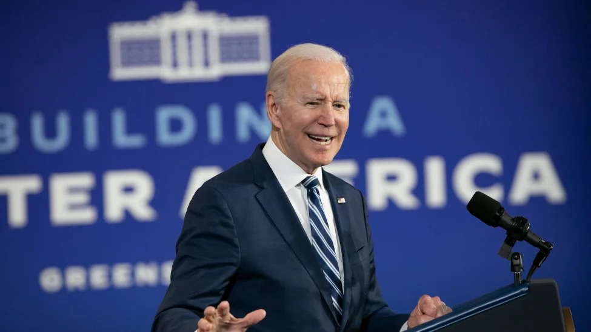

# Avatar

**One-file function** to create **circle-outlined avatar** with a desired color background.

| Input | Output |
| - | - |
|  |  |
|  |  |

## Usage

Move your photo to `./input/photo.jpg` and run:

```
python main.py \
    --input ./input/photo.jpg \
    --color #616DF8 \
    --output ./output/avatar.jpg
```

Result will be stored in `./output/avatar.jpg`.
